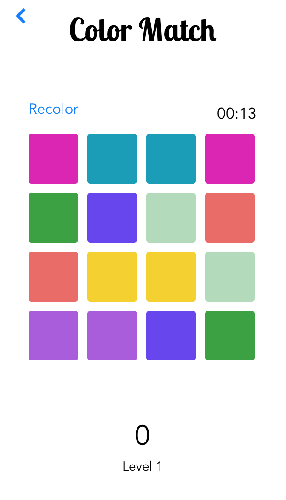

# Color Match #

[Download from iOS App Store](https://itunes.apple.com/us/app/color-match-squares/id1153724046)

Color Match is a fun and addictive color matching game where players are tasked with matching like colored squares. Sound too easy? Well don't you worry, with each level the color spectrum narrows, eventually where all of the squares look nearly identical.

## Technology ##

- Swift 3.0
- Compatible with iOS 7.0 and higher (iPad, iPhone)
- XCode 8.0
- OOP

## How to Play ##

Choose from one of the two difficulties: standard and hard. Standard has a 4 x 4 grid and hard has a 6 x 6 grid. You get 30 seconds for each level on standard difficulty, and 60 seconds for each level on hard.

### Standard ###

### Hard ###

You can remove a pair of matches by touching on both. If they aren't a match you will now see that the most recent square you touched is highlighted.

### Match ###

With each subsequent level, the color spectrum tightens, making it harder to distinguish between colors. However, at the beginning of each level you have the option to recolor the board within the constrains of the level. You can recolor the board as many times as you like, but be warned, spending too long recoloring will net you with less time to make matches, so recolor wisely.

### Recolor ###

It gets hard fast, but that makes it all the more fun. Each level has a higher score modifier than the last, so you get more points for the higher levels and you also get more points for matching faster. Try to get as high a score as possible and have fun!
